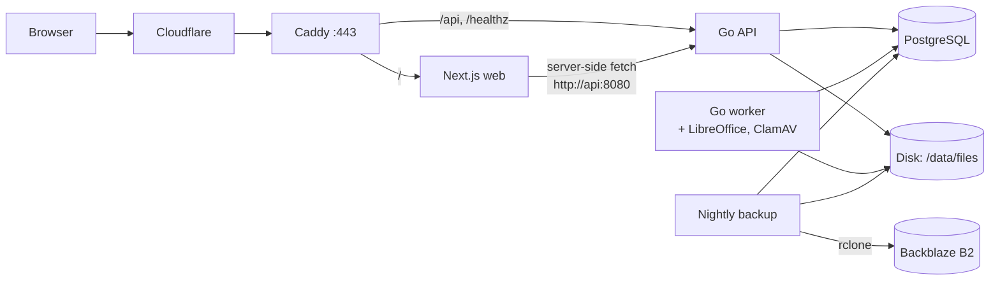
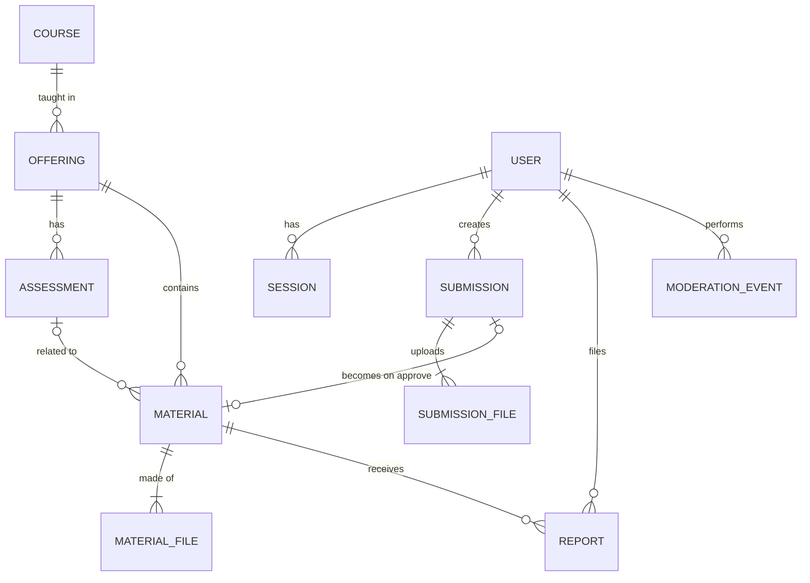
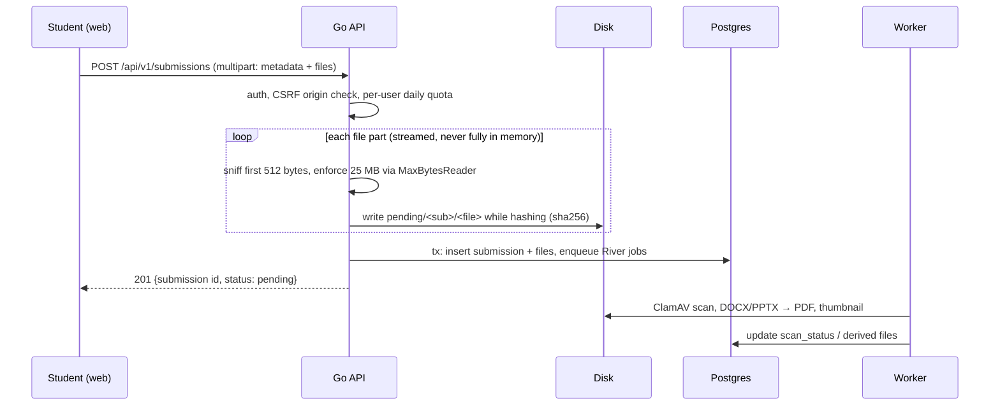

# NUPP — System Design

An open, community-driven archive of university learning materials (past midterms,
quizzes, finals, notes, slides). Anyone can browse; signed-in users can **suggest**
materials; nothing becomes public until a **moderator approves** it.

Everything is self-built and self-hosted: Go API, Next.js frontend, PostgreSQL, files on
disk — no backend-as-a-service.

---

## 1. Requirements

### Functional
| # | Requirement |
|---|-------------|
| F1 | Browse materials by **Course → Year/Term → Assessment** (Midterm 1, Quiz 3, Final…) |
| F2 | Search courses by code or title |
| F3 | Preview in browser: PDF, PNG, JPEG. DOC/DOCX/PPTX are converted to PDF in the background |
| F4 | Signed-in users submit materials (one submission = 1..N files, e.g. 6 photos of one exam) |
| F5 | Moderation queue: approve / reject (with reason) / edit metadata before approving |
| F6 | A submission may propose a **new course / offering / assessment**; it is created only on approval |
| F7 | Report button on any public material (wrong course, low quality, copyright) |
| F8 | Uploader sees status of their submissions (pending / approved / rejected + reason) |
| F9 | Moderators can unpublish a material (takedowns) |

### Non-functional
- **$0/month** hosting to start (domain optional, ~$10/year).
- Files up to 25 MB each, up to 10 files / 100 MB per submission.
- Unapproved files are **never** reachable through a public URL.
- Read-heavy; public pages server-rendered and indexable (students search "CSCI 151 midterm").
- Nightly off-site backups of database and files.

### Assumptions (change any time — they're cheap to revisit now)
- One university. Adding a `universities` table above `courses` later is a single migration.
- UI in English first; i18n (Kazakh/Russian) later.
- Anyone with a Google account can sign in; an optional email-domain allowlist is configurable.

---

## 2. Stack

| Layer | Choice | Why |
|-------|--------|-----|
| API | **Go** (stdlib `net/http` routing, Go ≥ 1.26) | You already know Go; one small static binary; great at streaming uploads |
| DB access | **PostgreSQL 17** + **pgx** + **sqlc** | Write real SQL, get type-safe Go code generated |
| Migrations | **goose** (embedded in the binary, run on startup) | Plain `.sql` files, versioned in git |
| API contract | **OpenAPI 3** spec (`api/openapi/openapi.yaml`) | Source of truth; a contract test keeps Go honest; TypeScript client is generated from it |
| Auth | Google OAuth/OIDC (`golang.org/x/oauth2` + `go-oidc`) + own server-side sessions | No passwords to store; sessions in Postgres, revocable |
| Background jobs | **River** (job queue stored in Postgres) | No Redis needed; transactional enqueue |
| Doc conversion | LibreOffice headless + poppler (`pdftoppm`) in a worker container | DOCX/PPTX → PDF, first-page thumbnails |
| Virus scan | ClamAV (`clamd`) in the worker | Cheap insurance for user uploads |
| File storage | Local disk behind a `storage.Storage` interface | Swap to MinIO / R2 / S3 later without touching handlers |
| Frontend | **Next.js** (App Router, TypeScript) + **Tailwind CSS** | Server rendering for SEO; biggest ecosystem to learn frontend in |
| API client | `openapi-typescript` + `openapi-fetch` | Typed calls generated from the same spec |
| PDF preview | `react-pdf` (PDF.js) | Renders in the browser |
| Reverse proxy | **Caddy** | Automatic HTTPS, one config file |
| Edge | **Cloudflare** free plan | DNS, caching, DDoS protection, hides server IP |
| Hosting | **Oracle Cloud Always Free** ARM VM (4 cores, 24 GB RAM, 200 GB disk) | $0; fallback: Hetzner CX22 ≈ €4/month, same setup |
| Backups | `pg_dump` + `rclone` → **Backblaze B2** (10 GB free) | Off-site copy; a disk failure must not erase the community's work |
| CI | GitHub Actions | `go vet`, tests (with real Postgres), sqlc drift check, web build |

---

## 3. Architecture



All containers run on one VM via Docker Compose. Frontend and API share one domain
(`/` and `/api`), so the session cookie is first-party and there is no CORS.

### Repository layout
```
api/                Go module github.com/Nurasick/NUPP/api
  cmd/server/       HTTP API entrypoint
  cmd/worker/       River worker (Plan 6)
  cmd/seed/         dev data
  internal/config/  env config
  internal/db/      pool, embedded goose migrations
  internal/httpx/   JSON envelope, errors, pagination
  internal/storage/ file storage interface + local disk impl
  internal/catalog/ public browsing (courses, offerings, materials, files)
  internal/auth/    OAuth, sessions, roles (Plan 3)
  internal/submission/  uploads (Plan 4)
  internal/moderation/  queue, approve/reject, reports (Plan 5)
  internal/server/  router + middleware
  openapi/openapi.yaml
web/                Next.js app (Plan 2)
deploy/             Caddyfile, backup scripts (Plan 7)
docker-compose.yml
```

### Storage layout
```
pending/<submission_id>/<file_id>.<ext>    only moderators, via authenticated API route
materials/<material_id>/<file_id>.<ext>    public, via GET /api/v1/files/{id}
```
Approval copies `pending/…` → `materials/…` and deletes the pending object.
Files are served by the API with `http.ServeContent` (supports `Range`, which PDF.js uses),
correct `Content-Type`, `X-Content-Type-Options: nosniff`, and long-lived cache headers
(file ids are immutable), so Cloudflare caches them.

---

## 4. Content Hierarchy & Data Model

```
CSCI 151 — Programming for Scientists and Engineers        ← course
 └─ 2025 · Fall · Prof. X                                  ← offering
     ├─ Midterm 1                                          ← assessment
     │   ├─ "Midterm 1 questions" (PDF)                    ← material → files
     │   └─ "Midterm 1 solutions" (6 × JPEG)
     ├─ Quiz 3
     └─ (General) — notes, slides not tied to an exam       ← material with assessment_id = NULL
```



| Table | Key columns | Notes |
|-------|-------------|-------|
| `courses` | `code` (unique, case-insensitive), `slug` (unique), `title`, `department` | slug = `csci-151` |
| `offerings` | `course_id`, `year`, `term` (`spring/summer/fall`), `instructor` | unique per course+year+term+instructor |
| `assessments` | `offering_id`, `kind` (`midterm/quiz/final/assignment/lab/other`), `number`, `label` | "Midterm 1" = kind midterm, number 1 |
| `materials` | `offering_id`, `assessment_id` (nullable), `title`, `type` (`questions/solutions/notes/slides/cheatsheet/other`), `description`, `published_at`, `hidden_at` (Plan 5) | public rows only |
| `material_files` | `material_id`, `storage_key`, `mime_type`, `size_bytes`, `sha256`, `position` | ordered pages |
| `users` | `google_sub` (unique), `email`, `display_name`, `role` (`user/moderator/admin`), `banned_at` | Plan 3 |
| `sessions` | `token_hash` (sha256 of cookie value), `user_id`, `expires_at` | Plan 3; raw token never stored |
| `submissions` | `user_id`, `status` (`pending/approved/rejected`), `proposed` (jsonb), `material_id`, `reviewed_by`, `reject_reason` | Plan 4 |
| `submission_files` | `submission_id`, `storage_key`, `original_name`, `mime_type`, `size_bytes`, `sha256`, `position`, `scan_status` | Plan 4 |
| `reports` | `material_id`, `user_id`, `reason`, `details`, `status` | Plan 5 |
| `moderation_events` | `actor_id`, `action`, `target_type`, `target_id`, `details` (jsonb), `created_at` | Plan 5; audit trail |

**Why `submissions.proposed` is JSON:** the submitter may reference a course/offering/assessment
that doesn't exist yet. Public tables stay clean; real rows are created (or matched) only on approval.

**Submission state machine** (single function `moderation.Transition`, which also writes `moderation_events`):
```
pending ──approve──▶ approved
pending ──reject───▶ rejected
```

---

## 5. API Surface

All JSON responses use one envelope: `{"data": …, "error": null | {"code","message"}, "meta"?: {"total","limit","offset"}}`.

| Method & path | Who | Plan |
|---------------|-----|------|
| `GET /healthz` | anyone | 1 |
| `GET /api/v1/courses?q=&limit=&offset=` | anyone | 1 |
| `GET /api/v1/courses/{slug}` — course + offerings + assessments | anyone | 1 |
| `GET /api/v1/offerings/{id}/materials` | anyone | 1 |
| `GET /api/v1/materials/{id}` — material + files | anyone | 1 |
| `GET /api/v1/files/{id}` — file bytes | anyone | 1 |
| `GET /api/v1/auth/google/login`, `GET /api/v1/auth/google/callback`, `POST /api/v1/auth/logout`, `GET /api/v1/me` | — | 3 |
| `POST /api/v1/submissions` (multipart) | user | 4 |
| `GET /api/v1/me/submissions` | user | 4 |
| `POST /api/v1/materials/{id}/reports` | user | 5 |
| `GET /api/v1/mod/submissions?status=`, `GET /api/v1/mod/submissions/{id}`, `GET /api/v1/mod/submission-files/{id}` | moderator | 5 |
| `PATCH /api/v1/mod/submissions/{id}`, `POST …/approve`, `POST …/reject` | moderator | 5 |
| `GET /api/v1/mod/reports`, `POST /api/v1/mod/reports/{id}/resolve`, `POST /api/v1/mod/materials/{id}/unpublish` | moderator | 5 |

---

## 6. Key Flows

### Upload (Plan 4)


### Moderation (Plan 5)
1. `/mod` lists pending submissions, oldest first, with duplicate warnings (same sha256 already public).
2. Moderator previews files (authenticated route to `pending/…`), fixes metadata.
3. **Approve** (one DB transaction): match-or-create course/offering/assessment → create material +
   material_files → status `approved` → `moderation_events` row. After commit, files are copied to
   `materials/…`; a River job retries the copy if it fails.
4. **Reject**: status `rejected` + reason + event; pending files deleted by a job after 30 days.

### Browse (Plans 1–2)
`/` search → `/courses/csci-151` (years → assessments) → `/materials/{id}` (preview + download).

---

## 7. Security

| Risk | Mitigation |
|------|-----------|
| Unapproved content public | Separate tables (`submission_files` vs `material_files`) and storage prefixes; public file route only reads `material_files`. |
| Disguised files | Allow-list by **sniffed** type, not extension; ZIP-based Office files verified by the worker; served with `nosniff` and fixed `Content-Type`. |
| Path traversal | Storage keys generated server-side; storage layer rejects `..`, absolute, `\` and `:` keys. |
| Upload abuse | `MaxBytesReader`, per-file and per-request limits, daily per-user quota, Caddy body limit, Cloudflare. |
| Session theft / CSRF | Random 256-bit tokens, only SHA-256 stored; cookie `HttpOnly; Secure; SameSite=Lax`; mutating routes require matching `Origin`. |
| Privilege escalation | Role loaded from DB per request; moderator routes behind middleware; every moderation action audited. |
| SQL injection | sqlc-generated parameterized queries only; `LIKE` input escaped. |
| Malware | ClamAV scan before a file is previewable by moderators. |
| Copyright | Report reason `copyright`, `/takedown` page, moderator unpublish, upload rules shown on the submit form. |
| Data loss | Nightly `pg_dump` + file sync to B2, 14-day retention, restore tested each semester. |

---

## 8. Cost

| Item | Monthly |
|------|---------|
| Oracle Always Free VM | $0 |
| Cloudflare free | $0 |
| Backblaze B2 (≤ 10 GB) | $0, then $0.006/GB |
| Domain (optional) | ~$0.85 |

---

## 9. Implementation Plans

Each plan ships working, tested software and is written when the previous one is done.

| # | Plan | Delivers |
|---|------|----------|
| 1 | [Backend foundation & catalog API](superpowers/plans/2026-10-07-plan-1-backend-foundation.md) | Go service, schema, read-only catalog API, file serving, OpenAPI contract test, Docker, CI |
| 2 | Web: browsing UI | Next.js app: search, course page, material viewer (PDF/images) |
| 3 | Auth | Google sign-in, sessions, roles, `/me` |
| 4 | Submissions | Streaming multipart upload, quotas, "My submissions" page |
| 5 | Moderation | Queue, approve/reject transaction, reports, unpublish, audit log, moderator UI |
| 6 | Worker | River jobs: ClamAV, Office → PDF, thumbnails, cleanup |
| 7 | Deploy | Oracle VM, Caddy, Cloudflare, backups, runbook |
