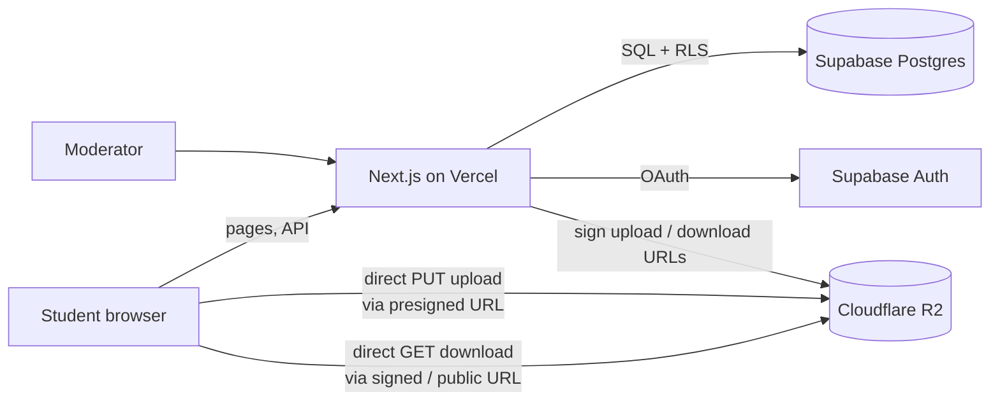
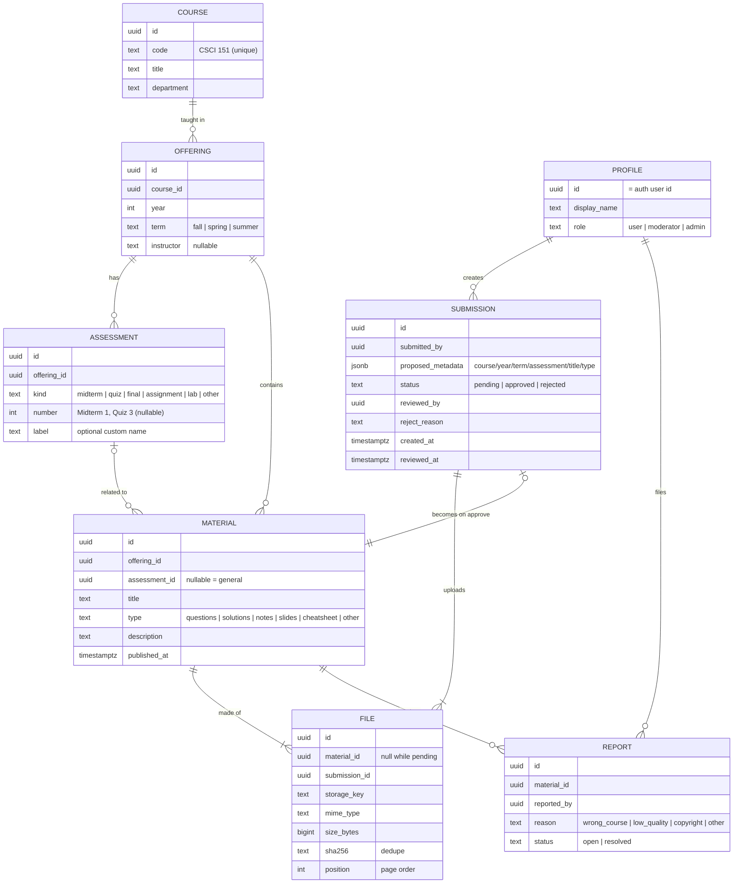
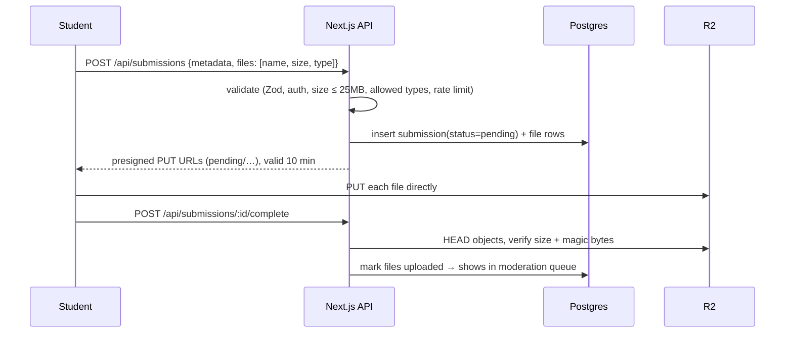

# NUPP — System Design

An open, community-driven archive of university learning materials (past midterms,
quizzes, finals, notes, slides). Anyone can browse; signed-in users can **suggest**
materials; nothing becomes public until a **moderator approves** it.

---

## 1. Requirements

### Functional
| # | Requirement |
|---|-------------|
| F1 | Browse materials by **Course → Year/Term → Assessment** (Midterm 1, Quiz 3, Final…) |
| F2 | Search by course code, title, instructor, tag |
| F3 | Preview in browser: PDF, PNG, JPEG (DOC/DOCX/PPTX: download first, preview later) |
| F4 | Signed-in users submit materials (one submission = 1..N files, e.g. 6 photos of one exam) |
| F5 | Moderation queue: approve / reject (with reason) / edit metadata before approving |
| F6 | Users can suggest a **new course** if it doesn't exist (also moderated) |
| F7 | Report button on any public material (wrong course, low quality, copyright) |
| F8 | Uploader sees status of their submissions (pending / approved / rejected + reason) |

### Non-functional
- **$0/month** to start; predictable, small cost once storage grows.
- Files up to ~25 MB each; total storage in the tens of GB within a few years.
- Unapproved files must **never** be publicly reachable.
- Read-heavy: thousands of downloads per upload → download bandwidth (egress) must be free or cheap.

---

## 2. Recommended Stack

| Layer | Choice | Free tier | Why |
|-------|--------|-----------|-----|
| Web app (UI + API) | **Next.js (App Router, TypeScript)** | — | One codebase for pages and API routes; huge ecosystem |
| Hosting | **Vercel Hobby** (or Cloudflare Pages) | Free | Zero-config deploys from GitHub, preview deploys per PR |
| Database | **Supabase Postgres** | 500 MB DB | Relational data fits perfectly (course → offering → assessment → material); Row Level Security |
| Auth | **Supabase Auth** (Google + GitHub OAuth) | 50k MAU | No passwords to manage; can restrict to university email domain |
| File storage | **Cloudflare R2** | 10 GB storage, **zero egress fees** | Downloads are the dominant cost driver — R2 makes them free |
| PDF preview | **PDF.js** (`react-pdf`) | Free | Renders in browser, no server work |
| Search | Postgres full-text search (`tsvector`) | Included | Enough for thousands of materials; swap to Meilisearch later if needed |
| UI | Tailwind CSS + shadcn/ui | Free | Fast to build, accessible primitives |
| Validation | Zod | Free | One schema shared by forms and API |

**Expected cost:** $0 until ~10 GB of files. After that R2 is **$0.015/GB-month**
(50 GB ≈ $0.60/month). Optional custom domain ≈ $10/year.

### Alternatives considered

| Option | Verdict |
|--------|---------|
| **Pure GitHub repo** (files in git, moderation = Pull Requests, static site via GitHub Pages) | Truly $0 and moderation is built in, **but** students who aren't developers can't open PRs, binary files bloat git (1–5 GB soft repo limit, 100 MB/file). Good for a weekend prototype, bad for a real community. |
| Supabase Storage instead of R2 | Simpler (one vendor), but only 1 GB free and egress counts against 5 GB/month. Fine for MVP, will hit limits quickly. |
| Firebase | Works, but NoSQL is a worse fit for a strict hierarchy; Storage now needs the paid Blaze plan. |
| Django/Python backend | Great admin panel for moderation for free, but needs a server host (no good free tier anymore) — more ops. |
| Google Drive as storage | Free 15 GB but API quotas, awkward permissions, not designed as an app backend. |

**Supabase caveat:** free projects pause after 7 days without traffic. A tiny scheduled
ping (GitHub Actions cron) keeps it awake; upgrading later is $25/month.

---

## 3. Architecture



Files **never pass through the Next.js server** — the server only issues short-lived
presigned URLs. This keeps Vercel's free-tier limits (request size, bandwidth) out of the picture.

### Storage layout in R2

```
pending/<submission_id>/<file_id>.<ext>   ← private, only moderators get signed URLs
public/<material_id>/<file_id>.<ext>      ← served to everyone (via public bucket domain or signed URLs)
```

On approval, the server copies `pending/…` → `public/…` and deletes the original.
On rejection, the pending objects are deleted (or kept 30 days for appeals).

---

## 4. Content Hierarchy & Data Model

How materials are organised (what the user sees):

```
CSCI 151 — Programming for Scientists and Engineers        ← Course
 └─ 2025 · Fall · Prof. X                                  ← Offering (year + term + instructor)
     ├─ Midterm 1                                          ← Assessment
     │   ├─ "Midterm 1 questions" (PDF)                    ← Material
     │   └─ "Midterm 1 solutions" (6 × JPEG)
     ├─ Quiz 3
     └─ (General)  — lecture notes, slides, cheat sheets not tied to an exam
```



**Why `proposed_metadata` is JSON on the submission:** a submitter may reference a course
or offering that doesn't exist yet. The moderator confirms/edits it, and only on approve
do we create the real `offering` / `assessment` / `material` rows. The public tables stay clean.

---

## 5. Key Flows

### Upload (suggest a material)


### Moderation
1. Moderator opens `/moderate` → list of pending submissions, oldest first.
2. Preview files via short-lived signed URLs to `pending/…`.
3. Edit metadata (fix course, year, assessment), then:
   - **Approve** → transaction: upsert offering/assessment → create material → move objects to `public/` → set `status=approved`.
   - **Reject** → `status=rejected`, `reject_reason`, delete objects.
4. Uploader sees the result on `/me/submissions`.

### Browse
`/` → course list (search) → `/courses/csci-151` → years/terms → assessments → material page with preview + download.
All public pages are server-rendered and cacheable (good SEO — students google "CSCI 151 midterm").

---

## 6. Security & Abuse Prevention

| Risk | Mitigation |
|------|-----------|
| Unapproved / malicious content becoming public | Files land in `pending/` (private). Only approval moves them to `public/`. |
| Disguised files (`.exe` renamed `.pdf`) | Allow-list MIME types **and** check magic bytes after upload; serve with `Content-Disposition` + correct `Content-Type`; `X-Content-Type-Options: nosniff`. |
| Huge uploads / storage abuse | Presigned URL with fixed `Content-Length`; per-user limits (e.g. 20 submissions/day, 200 MB/day). |
| Spam accounts | OAuth only; optional restriction to university email domain; new users' uploads always moderated. |
| Privilege escalation | Postgres **Row Level Security**: users can only read their own submissions; only `moderator`/`admin` roles can update status. Role is checked server-side, never trusted from the client. |
| Duplicate uploads | SHA-256 per file; warn moderator on hash match. |
| Copyright / takedown requests | Report button with `copyright` reason, a `/takedown` page with contact, and an admin "unpublish" action. Write clear upload rules (no paid textbooks, no materials explicitly marked "do not distribute"). |
| Viruses in DOC/DOCX | Moderators preview only PDFs/images in-browser; Office files flagged. Later: ClamAV scan job. |

---

## 7. Roadmap

**Phase 0 — Foundation (this commit)**: design doc, repo, license.

**Phase 1 — MVP (read-only browsing)**
- Next.js + Tailwind scaffold, Supabase project, schema migrations, seed a few courses.
- Course list, course page, material page with PDF/image preview.

**Phase 2 — Contributions**
- OAuth sign-in, submission form with multi-file upload to R2.
- "My submissions" page.

**Phase 3 — Moderation**
- Moderator queue, approve/reject, metadata editing, roles.
- Reports.

**Phase 4 — Polish**
- Full-text search, DOCX/PPTX → PDF preview conversion (background job w/ LibreOffice/Gotenberg),
  upvotes, "who contributed" credits, Kazakh/Russian i18n if needed.

---

## 8. Open Questions

1. **One university or many?** If many, add a `university` table above `course` (cheap now, painful later).
2. **Who can sign up?** Anyone with Google/GitHub, or only `@<university-domain>` emails?
3. **Who are the first moderators?** (You + a few trusted students.)
4. **Language(s) of the UI?**
5. **Licence for the content?** Code is MIT; uploaded materials remain their authors' — we host them for educational use and honour takedown requests.
